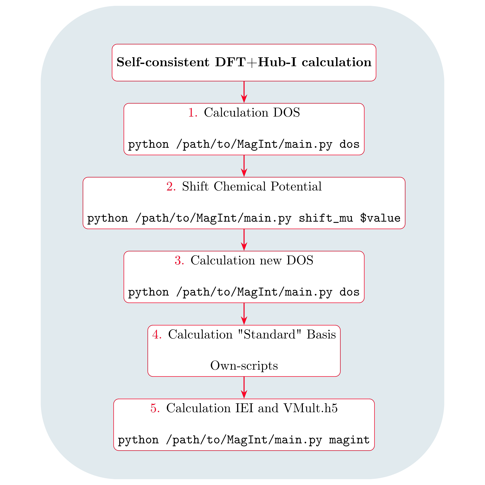

.. index:: MagInt

.. module:: MagInt

MagInt
**********
      

MagInt implements the force-theorem Hubbard-I approach to the calculation of intersite exchange interactions in correlated insulators.
The formalism is given in `L. V. Pourovskii Phys. Rev. B 94, 115117 (2016)  <https://journals.aps.org/prb/abstract/10.1103/PhysRevB.94.115117>`_.
This Python-3 version is based on the  `TRIQS software library <https://triqs.github.io>`_, and the DFT code interface `TRIQS/DFTTools <https://triqs.github.io/dft_tools>`_. The current version of MagInt is interfaced with TRIQS 3.1.x and it comes with its own Fortran-based Hubbard-I solver.

For installation use the same branch / tag as your triqs installation. More
information under :ref:`installation`. 

Learn how to use magint in the :ref:`documentation` and the via the :download:`Manual (pdf) <_static/magint_manual.pdf>`.

Workflow of a MagInt calculation
=================================================

The workflow of a typical MagInt calculation is : 

Detailed in the :download:`Manual <_static/magint_manual.pdf>`.

------------

.. toctree::
   :maxdepth: 2
   :hidden:

   installation
   documentation
   issues
   ChangeLog.md
